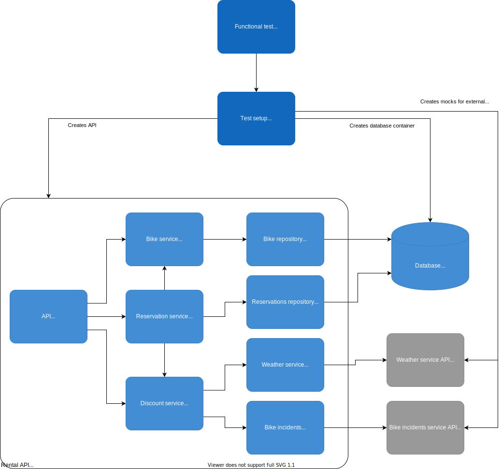

# Testing

Good testing is critical for any project. In this article, we won't focus on unit testing or test coverage. I'll try to explain the important parts to test and how to do it easily.

## How good architecture helps with good testing

Following clean architecture principles, we've decoupled the application, data access, and API layers. So now, we have contracts between them in the form of interfaces.
What it means for testing is that now for each layer, we can substitute its dependencies with mocks. Therefore, we can test each layer in separation. Remember, interfaces can serve as mocking points!

In the example application tests, we test all the components as a whole, focusing on functional testing. But still, we use this property to mock external services that we can't use for testing.

## Testing the example app

There are a lot of articles about testing in Go. But in this guide, I want to focus on what's crucial - **functional testing**.

Why start with functional testing?

1. API is the contract between our code and the user. Therefore, any unwanted change to that contract could result in failures on our client-side. Moreover, by introducing unwanted API behavior, we could not be aware that our client code is failing - we won't get any alerts or errors in the logs.
2. Your code will evolve over time, but probably existing API endpoints will stay more or less the same. Therefore, writing tests based on the API will reduce the maintenance burden.
Whenever you change the internal workings of the application, API level tests should work fine without any changes.
Even more importantly, such tests would be a **huge** help in case of some heavy refactoring in the future.

So we want to set up the test suite to cover as much of the code as possible using functional tests. The following diagram shows how the functional test case is going to look like:

For each functional test, we're going to prepare an API, listening on an actual network socket. It would be set up in the same way as in `cmd/app`, but with the test database and external service mocks. And in each test, we're going to create an actual GRPC client, make some GRPC requests and check the responses.

### Dealing with dependencies

We have three external systems that our service needs to work: database, weather service, and bike incident service. There's no way to create actual, working weather or bike incident services. So for those, we'll use mocks. But we can create a local `Postgres` database using `Docker` and we're going to use `ory/dockertest` library for that.

In general, I advise testing with actual databases/services whenever feasible.

For database I created a test helper function, that creates a `Postgres` container, and returns connection data - `internal/test/db.go, startDB`. For other services, I create mocks in each test case using `gomock`.

*Hint: To create mocks, I use `github.com/golang/mock/gomock` and `github.com/golang/mock/mockgen` tool. Check `Makefile` and `go:generate` commands in go files for more details.*

If you want to know more about using and testing with Postgres in go, check out this great video: [GopherCon 2020: Johan Brandhorst-Satzkorn - A Journey to Postgres Productivity with Go](https://www.youtube.com/watch?v=AgHdVPSty7k)

### Testing API

We have to have some helper function to set up the whole API for the test (this big container named "Rental API" in the diagram above). It's implemented in: `internal/test/testsetup.go, newFunctionalTestSetup`. `newFunctionalTestSetup` creates all the app components and composes them together into a fully functional service. Then it creates GRPC server that exposes this service, and the client that would be used for testing. 

All "access points" to this whole system are available in the `testSetup` struct, that is the result of running `newFunctionalTestSetup`. Later in tests you will have access a GRPC client, and db adapters directly.

The pattern for API testing looks like this:

- Write a test for an API method.
- In the test create `Postgres` db container using `internal/test/db.go, startDB` helper. You will get a struct with the connection details.
- Then initiate an object with all the components bound together and start the GRPC server, using `newFunctionalTestSetup` function.
- If necessary, prepare test data using adapters and helper functions (check `TestListReservations` and `createReservation` helper function to see the example).
- Prepare a test request and send it to the server.
- Check the response against the expected result.

### Separating "heavy" functional tests from "light" unit tests

It's useful to be able to run only the fast tests, skipping those that require dependencies like databases or external services. So, for example, I like to have a "fast test" set up as a git hook (together with linting).
It prevents me from committing broken code accidentally.

To do that, I propose adding a build flag to all the tests with external dependencies. In the example code, we use `func` build flag. And then in the `Makefile` you have to "helpers" to run tests:

- `make test` - will run all but the functional tests.
- `make test-all` - will run all the tests.

You can use these commands in the git hook scripts.
